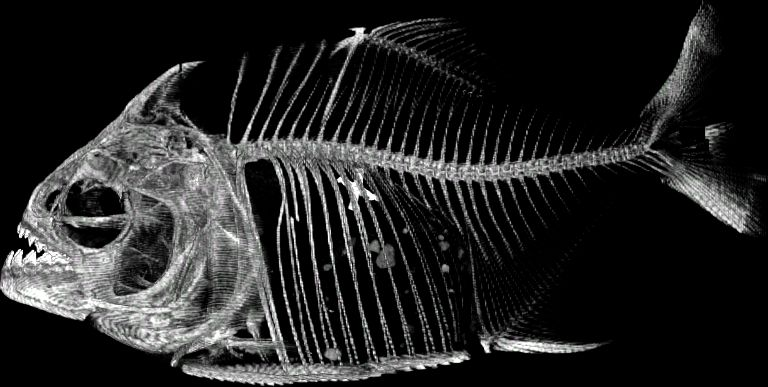

It's been almost a year since I've gotten involved with 3D imaging research, and I've definitely learned a lot--from image segementation to reconstructing stack scans into 2D and 3D visualizations. While I'm not going to post a entire tutorial on how to access/manipulate image data, I will be periodically posting cool images and/or videos extracted from my personal research. 

I'm currently drafting posts for the [Cabinet of Curiosity](http://curiositydata.org/) natural history blog, which has a full, step-by-step tutorial on my process for handling imaging data from [MorphoSource](https://www.morphosource.org/). There's also a ton of really cool posts and interviews as well!

---
This is basically what the recreated stack scans look like for the specific dataset that I'm working with. Visualized using FIJI

This is a 2D view of all the stack scans viewed from above (stacks). You can create this using FIJI as well, but I figured out a way to code this out in jupyter and export it as a .gif file (as shown on the left). And shown on the right, is what the side view of the image should look like. 

<figure class="half">
	
	
</figure>
